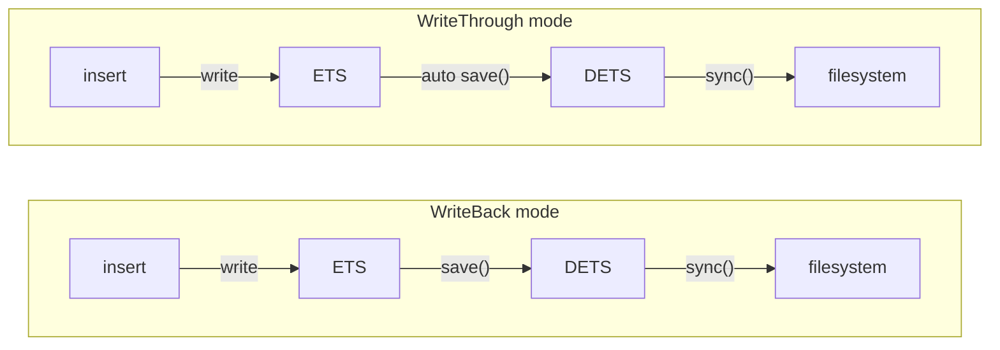

shelf provides four persistence operations to control how and when data moves between memory (ETS) and disk (DETS).

## Overview

| Function | Behavior |
|----------|----------|
| `save(table)` | Snapshot ETS → DETS (replaces DETS contents) |
| `reload(table)` | Discard ETS, reload from DETS |
| `sync(table)` | Flush DETS write buffer to OS |
| `close(table)` | Save + close DETS + delete ETS |

## save

Atomically snapshots the entire ETS table into DETS, replacing all DETS contents with the current ETS state. Uses `ets:to_dets/2` internally — the transfer happens efficiently inside the Erlang VM without materializing the table as a list.

```gleam
// After a batch of writes...
let assert Ok(Nil) = set.save(table)
```

**When to use**: In WriteBack mode, call `save()` to persist changes to disk. Common strategies:
- On a periodic timer (e.g., every 30 seconds)
- After a batch of N writes
- At application shutdown
- After critical data changes

In WriteThrough mode, `save()` is called automatically after every write, so you rarely need to call it manually.

## reload

Clears the ETS table and loads all DETS contents into it. Discards any unsaved changes in ETS.

```gleam
// Undo unsaved changes
let assert Ok(Nil) = set.reload(table)
```

**When to use**: In WriteBack mode, use `reload()` to discard in-memory changes and revert to the last saved state. In WriteThrough mode, ETS and DETS are always in sync, so `reload()` is rarely needed.

## sync

Flushes the DETS internal write buffer to the OS filesystem. DETS buffers writes for performance — `sync()` forces those buffers to disk.

```gleam
let assert Ok(Nil) = set.sync(table)
```

**When to use**: In WriteThrough mode, after a critical write when you need to guarantee the data has reached the filesystem. In WriteBack mode, `sync()` is less useful since you control persistence via `save()`.

:::note[save vs sync]
`save()` copies data from ETS into DETS. `sync()` flushes DETS's internal buffer to the OS. They serve different purposes:
- After `save()`: data is in DETS but may be in OS buffers
- After `sync()`: data is flushed from DETS buffers to the filesystem
- For maximum durability: call `save()` then `sync()`
:::

## close

Performs a final `save()`, closes the DETS file, and deletes the ETS table. The table handle must not be used after closing.

```gleam
let assert Ok(Nil) = set.close(table)
```

For guaranteed cleanup, use `with_table` instead of manual open/close:

```gleam
let assert Ok(Nil) = {
  use table <- set.with_table("cache", "data/cache.dets", decode.string, decode.string)
  set.insert(into: table, key: "key", value: "value")
}
// table is automatically closed here
```

## Persistence Flow


