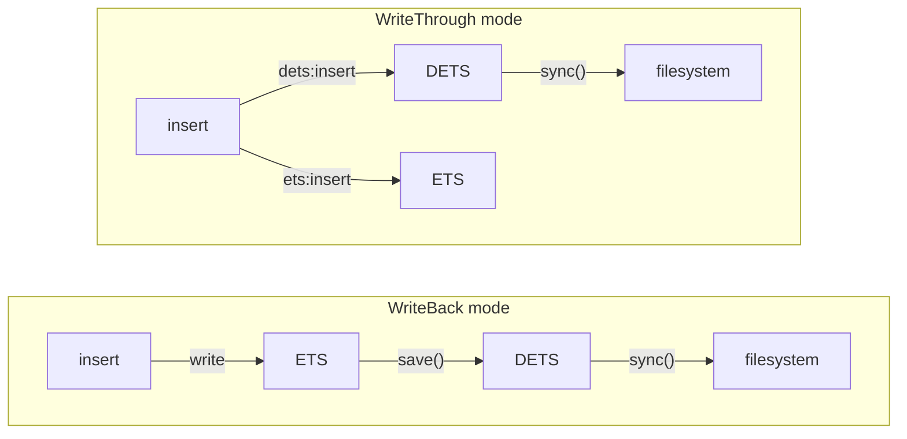

shelf provides four persistence operations to control how and when data moves between memory (ETS) and disk (DETS).

## Overview

| Function | Behavior |
|----------|----------|
| `save(table)` | Atomic snapshot ETS → DETS (writes to a temp file, then renames for crash safety) |
| `reload(table)` | Discard ETS, reload from DETS |
| `sync(table)` | Flush DETS write buffer to OS |
| `close(table)` | Save + close DETS + delete ETS |

## save

Atomically snapshots the entire ETS table into DETS, replacing all DETS contents with the current ETS state.

The save uses a temp-file-plus-rename strategy for crash safety: data is written to a temporary file first, then atomically renamed over the original DETS file. If the process is killed mid-save, the original file remains intact until the rename succeeds.

Internally, the ETS-to-DETS copy uses `ets:to_dets/2`, which transfers entries inside the Erlang VM without materializing the table as a list.

```gleam
// After a batch of writes...
let assert Ok(Nil) = set.save(table)
```

**When to use**: In WriteBack mode, call `save()` to persist changes to disk. Common strategies:
- On a periodic timer (e.g., every 30 seconds)
- After a batch of N writes
- At application shutdown
- After critical data changes

In WriteThrough mode, every write goes to DETS directly (via `dets:insert`), so data is already persisted — you rarely need to call `save()` manually.

For exactly which on-disk layer this call advances data past, and what
guarantees it gives across crashes, see [Durability story](#durability-story).

## reload

Clears the ETS table and loads all DETS contents into it. Discards any unsaved changes in ETS.

```gleam
// Undo unsaved changes
let assert Ok(Nil) = set.reload(table)
```

**When to use**: In WriteBack mode, use `reload()` to discard in-memory changes and revert to the last saved state. In WriteThrough mode, ETS and DETS are always in sync, so `reload()` is rarely needed.

## sync

Forces DETS's internal write buffer out to the open DETS file by calling
`dets:sync/1`. Useful in WriteThrough mode after a critical write, when you
need pending DETS buffers reflected in the on-disk file before continuing.

```gleam
let assert Ok(Nil) = set.sync(table)
```

In WriteBack mode `sync()` is rarely needed — `save()` already writes a
fresh DETS file and reopens it.

## Durability story

Data goes through several layers between an `insert()` call and physical
storage. This section is the **single source of truth** for which call
addresses which layer; other pages link here.

| Layer | Where data lives | Call that advances data past this layer |
|-------|------------------|------------------------------------------|
| 1 | Application memory | `insert()`, `delete_*`, `update_counter` |
| 2 | ETS table (in-process) | WriteBack: `save()`. WriteThrough: every write |
| 3 | DETS in-memory buffer | `sync()` (open DETS) or `save()` (closes a temp DETS, which flushes) |
| 4 | DETS file content (OS page cache) | `save()` writes a temp file then atomically `rename()`s over the original |
| 5 | Physical disk | Not exposed — DETS does not surface `fsync(2)` on the file or its directory |

What the calls actually do:

- **`save()`** snapshots ETS → a *temporary* DETS file (`ets:to_dets/2`), closes
  that temp file (flushing its buffer), then atomically `file:rename/2`s it
  over the original DETS path and reopens at the original path. The rename
  is POSIX-atomic, so a process or VM crash mid-`save()` leaves either the
  previous file or the new file fully present — never a half-written file.
- **`sync()`** calls `dets:sync/1` on the *currently open* DETS, draining its
  in-memory write buffer into the file. It does **not** invoke `fsync(2)` on
  the file descriptor and does **not** fsync the containing directory.
- **`reload()`** discards the ETS table and rebuilds it from the on-disk DETS
  file. It does not change durability — it changes which copy of the data
  the table reflects.
- **`close()`** performs a `save()` and then closes DETS / deletes ETS.

Practical guarantees:

| You want… | Then call |
|-----------|-----------|
| WriteBack changes safe across a process crash | `save()` |
| WriteThrough writes flushed past DETS's buffer into the file | `sync()` |
| Strongest crash safety shelf can provide | `save()` (atomic rename, then no further shelf call is needed in WriteBack) |
| `fsync(2)`-level guarantees against OS crash / power loss | Not provided. If you need this, call out to a process that opens the DETS file path with `file:open/2` and `file:sync/1`, or place the data directory on a filesystem mounted with stronger durability semantics. |

## Memory cost on open and reload

When a table is opened (or reloaded), shelf streams DETS entries through
`dets:foldl/3`, validates each entry through the user-supplied decoders,
and inserts them into ETS in batches. Peak extra memory during this
streaming load is roughly **~1× the table size** — the previous
materialise-then-insert approach used ~3×.

This is a one-time startup cost. After the load returns, all reads and
writes happen at raw ETS speed (no further DETS I/O on the read path).
Startup time still scales linearly with table size, so very large tables
(hundreds of MB+) have noticeable open latency even though peak memory is
bounded.

This is the canonical reference for shelf's load-time memory and time
cost; other pages link here.

## close

Performs a final `save()`, closes the DETS file, and deletes the ETS table. The table handle must not be used after closing.

```gleam
let assert Ok(Nil) = set.close(table)
```

For guaranteed cleanup, use `with_table` instead of manual open/close:

```gleam
let assert Ok(Nil) = {
  use table <- set.with_table("cache", "data/cache.dets", base_directory: "/app/data", key: decode.string, value: decode.string)
  set.insert(into: table, key: "key", value: "value")
}
// table is automatically closed here
```

## Persistence Flow


