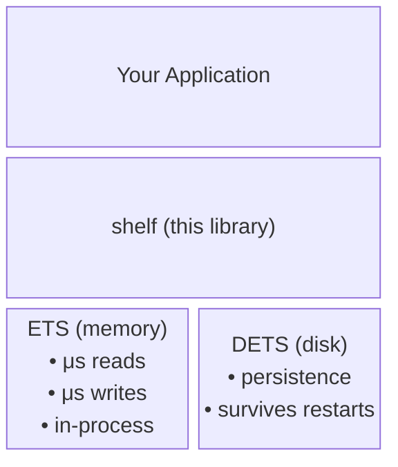

:::caution[Pre-1.0 Software]
shelf is not yet 1.0. The API is unstable, features may be removed in minor releases, and quality should not be considered production-ready. We welcome usage and feedback in the meantime!
:::

shelf combines **ETS** (fast, in-memory) with **DETS** (persistent, on-disk) to give you microsecond reads with durable storage. It implements the classic Erlang persistence pattern, wrapped in a type-safe Gleam API.

## How it works

**Reads** always go to ETS — consistent microsecond latency regardless of table size.

**Writes** go to ETS immediately. Persistence to DETS depends on the write mode.

## Why shelf?

If you only need ETS or DETS individually, check out these standalone wrappers:

- **[bravo](https://hex.pm/packages/bravo)** — Type-safe ETS wrapper for Gleam
- **[slate](https://hex.pm/packages/slate)** — Type-safe DETS wrapper for Gleam

shelf coordinates both together, using Erlang's native `ets:to_dets/2` for efficient bulk saves. When loading from disk, entries are validated individually through user-provided decoders, ensuring type safety at the boundary between untyped DETS storage and your Gleam code.

## Key features

- **Microsecond reads**: All reads go through ETS for consistent performance
- **Runtime type safety**: Decoder-gated loading ensures data from disk matches your Gleam types
- **Write modes**: Choose between WriteBack (batched) or WriteThrough (immediate persistence)
- **Three table types**: `set`, `bag`, `duplicate_bag`
- **Atomic counters**: Increment integer values atomically in ETS
- **Safe resource management**: `with_table` ensures tables are always closed
- **No native dependencies**: No NIFs or build steps; backed entirely by OTP's built-in ETS and DETS
